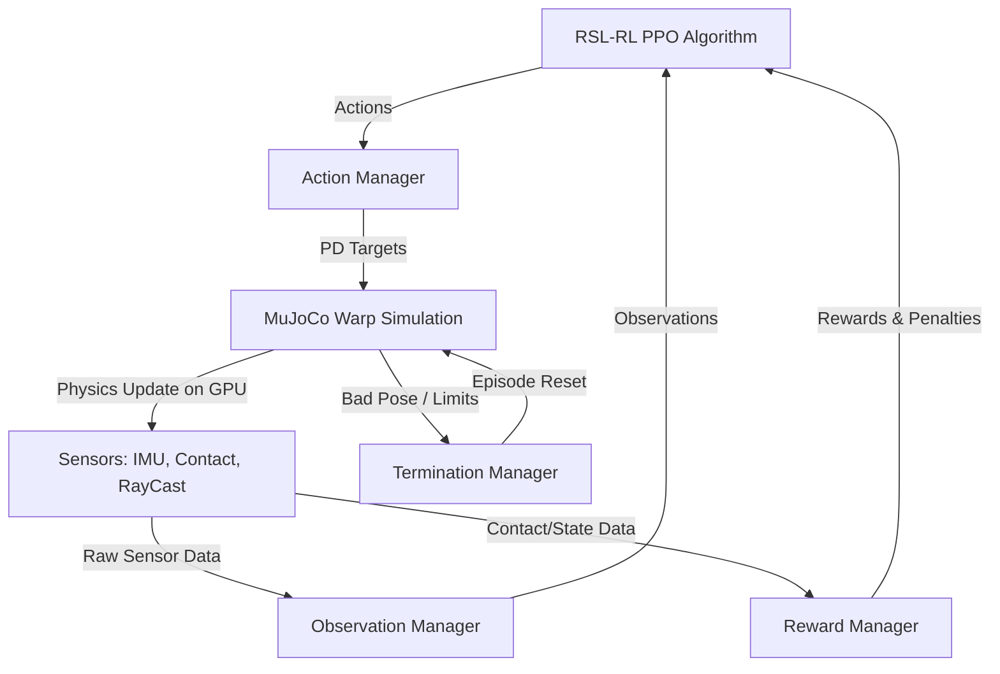

# BÁO CÁO BÀI TẬP LỚN: TÌM HIỂU HỆ THỐNG MJLAB & HUẤN LUYỆN CHÍNH SÁCH LOCOMOTION / MIMIC CHO HUMANOD LIMX HU_D03

**Đơn vị thực hiện:** Học viên nghiên cứu AI & Robotics
**Nền tảng sử dụng:** MuJoCo Lab (`mjlab`) & Warp-GPU Physics Engine
**Mẫu robot mục tiêu:** Humanoid LimX HU_D03 (31 Khớp chủ động, 24 Khớp thụ động)

---

## PHẦN I: PHÂN TÍCH CẤU TRÚC NỀN CODE & CƠ CHẾ HOẠT ĐỘNG CỦA MJLAB

### 1. Tổng Quan Kiến Trúc Nền Code (Architecture Overview)
`mjlab` là một thư viện học tăng cường (Reinforcement Learning) hiệu năng cao cho robot, tích hợp cổng giao tiếp dựa trên **Isaac Lab Manager-based API** kết hợp với engine vật lý **MuJoCo Warp** chạy hoàn toàn trên GPU (CUDA). 

Sơ đồ hoạt động tổng quát:


### 2. Ý Nghĩa Và Vai Trò Của Các Module Chính
Lõi nguồn nằm trong thư mục `/src/mjlab/` được phân tách chặt chẽ:

*   **`mjlab.entity` (Entity)**: Lớp trừu tượng đại diện cho các thực thể vật lý (Robot, Địa hình, Vật thể). Nó đóng vai trò là giao diện quản lý dữ liệu liên kết động học (khớp, liên kết, vận tốc, lực tiếp xúc) trực tiếp từ bộ nhớ đệm GPU của MuJoCo.
*   **`mjlab.sim` (Simulation)**: Thiết lập cấu hình và khởi tạo môi trường mô phỏng MuJoCo. Module này quản lý bước thời gian (timestep), số lần lặp giải quyết ràng buộc (solver iterations), và tích hợp compiler Warp để biên dịch các nhân tính toán (CUDA kernels) song song.
*   **`mjlab.managers` (Managers)**:
    *   **Action Manager (`action_manager.py`)**: Nhận đầu ra của mạng nơ-ron (chính sách Actor) và ánh xạ thành tín hiệu điều khiển vật lý (ví dụ: mục tiêu góc khớp cho bộ điều khiển PD).
    *   **Observation Manager (`observation_manager.py`)**: Thu thập dữ liệu trạng thái, áp nhiễu (noise) thực tế, và ghép thành vector quan sát cho Actor và Critic.
    *   **Reward Manager (`reward_manager.py`)**: Tính toán tổng điểm thưởng/phạt ở mỗi bước mô phỏng để hướng dẫn robot học tập.
    *   **Termination Manager (`termination_manager.py`)**: Đánh giá các điều kiện kết thúc sớm (ví dụ: robot ngã, vượt giới hạn thời gian) để reset môi trường.
    *   **Event Manager (`event_manager.py`)**: Quản lý các sự kiện ngẫu nhiên hóa (Domain Randomization) như đẩy robot (push), thay đổi ma sát chân, sai số cảm biến để tăng độ bền bỉ (robustness).

### 3. Quy Trình Hoạt Động Của Một Bước Môi Trường (Step Loop Execution)
Tại mỗi bước lặp huấn luyện, nền code thực thi tuần tự trên GPU thông qua các nhân CUDA:
1.  **Chính sách (Policy)** nhận vector quan sát $O_t$ và xuất ra hành động $A_t$.
2.  **Action Manager** giải mã $A_t$ thành các vị trí khớp mong muốn và nhân với tỉ lệ hành động (action scale).
3.  **PD Controller** trên GPU tính toán mô-men lực đẩy khớp: $\tau = K_p (q_{des} - q) - K_d \dot{q}$.
4.  **MuJoCo Warp Simulation** thực hiện tích phân vật lý bước thời gian (mặc định decimation = 4, tức là mô phỏng 4 bước nhỏ $0.005s$ để ra một bước môi trường $0.02s$).
5.  **Sensors** cập nhật dữ liệu tiếp xúc chân, IMU phần thân, và tia quét địa hình (RayCasts).
6.  **Observation & Reward Managers** tính toán vector $O_{t+1}$ và phần thưởng $R_{t+1}$.
7.  **Termination Manager** kiểm tra nếu góc nghiêng IMU của robot vượt quá giới hạn $\rightarrow$ Reset trạng thái robot về keyframe mặc định.

---

## PHẦN II: THUẬT TOÁN TRAINING TRONG MJLAB (RSL-RL PPO)

`mjlab` sử dụng thuật toán **PPO (Proximal Policy Optimization)** được triển khai tối ưu hóa song song hóa trên GPU bởi thư viện `rsl_rl`.

### 1. Kiến Trúc Mạng Nơ-ron (Actor-Critic)
*   **Mạng Actor (Policy Network)**: Nhận quan sát của robot và xuất ra phân phối Gauss của hành động (các góc khớp). 
    *   Mặc định cấu hình MLP: 3 lớp ẩn lần lượt `[512, 256, 128]` nơ-ron với hàm kích hoạt `ELU`.
    *   Sử dụng cơ chế chuẩn hóa quan sát (Observation Normalization = True) để ổn định gradient.
*   **Mạng Critic (Value Network)**: Nhận thông tin chi tiết hơn (bao gồm cả các thông tin không có thực tế như vận tốc tuyến tính thực, lực tiếp xúc chân) để dự đoán giá trị kỳ vọng của phần thưởng dài hạn.
    *   Kiến trúc MLP tương đương Actor để giữ tính đồng bộ thăng bằng.

### 2. Các Siêu Tham Số Huấn Luyện Cốt Lõi (Hyperparameters)
*   **Entropy Coefficient (`entropy_coef = 0.01`)**: Hệ số khuyến khích khám phá. Nếu robot bị nghiệm cục bộ (đứng im/không dám bước đi), ta nâng hệ số này để khuyến khích robot thử nghiệm các tư thế mới.
*   **Desired KL (`desired_kl = 0.01`)**: Kiểm soát độ lệch KL giữa chính sách cũ và mới để tránh các bước cập nhật quá lớn làm sụp đổ chính sách.
*   **Mini-batches (`num_mini_batches = 4`)**: Chia nhỏ tập dữ liệu thu được từ hàng nghìn môi trường song song thành các batch nhỏ để tăng tốc tính toán trên GPU.
*   **Timesteps per Env (`num_steps_per_env = 24`)**: Robot thu thập 24 bước dữ liệu trước khi thực hiện một đợt tối ưu hóa PPO.

---

## PHẦN III: HUẤN LUYỆN LOCOMOTION POLICY CHO LIMX HU_D03

Để chuyển đổi thành công từ robot mặc định G1 sang humanoid **LimX HU_D03**, chúng ta phải giải quyết 3 thách thức lớn về cơ học:

### 1. Sắp Xếp Liên Kết Khớp Thụ Động (Achilles Parallel Linkages)
*   **Đặc điểm HU_D03**: Robot có 55 khớp cơ học, nhưng trong đó chỉ có **31 khớp chủ động** (actuated), còn lại **24 khớp thụ động** (rod linkages, cổ chân 4-bar Achilles).
*   **Giải pháp cấu hình**:
    1.  Khóa danh sách khớp chủ động điều khiển trong `ActionTermCfg` bằng bộ lọc chính quy `ACTUATED_JOINT_NAMES`.
    2.  Triển khai **Pose Reward Masking**: Chỉ phạt độ lệch tư thế đối với 31 khớp chủ động này. Loại bỏ hoàn toàn các khớp thụ động (như thanh truyền cổ chân, các khớp 4-bar) khỏi phần thưởng tư thế. Nếu phạt cả khớp thụ động, robot sẽ chọn đứng im làm nghiệm tối ưu vì khi bước đi, các khớp thụ động này buộc phải di chuyển theo động học cưỡng bức.

### 2. Sửa Đổi Khớp Eo Khác Biệt (Parallel Waist vs Direct Joint)
*   Robot G1 sử dụng khớp eo xoay/gập trực tiếp (`waist_roll`, `waist_pitch`).
*   Robot HU_D03 sử dụng liên kết song song được kéo bởi các khớp eo `waist_yaw`, `waist_A`, và `waist_B`. 
*   **Giải pháp**: Xóa bỏ các mẫu phạt khớp không tồn tại (`r"waist_roll.*"`, `r"waist_pitch.*"`) khỏi cấu hình sai số `std_walking` và `std_running` để tránh lỗi crash chương trình (`ValueError: Not all regular expressions are matched`).

### 3. Giáo Trình Huấn Luyện Từng Bước (Curriculum Stages)
Để robot HU_D03 học đi từ dễ đến khó một cách an toàn:
*   **Giai đoạn đầu (Step 0)**: Giới hạn vận tốc XY từ `(0.0, 0.5)` m/s, không cho xoay người (`ang_vel_z = 0`). Tắt lực đẩy nhiễu loạn để robot đứng vững và học bước đi sơ bộ.
*   **Giai đoạn hai (Step 48.000)**: Mở rộng vận tốc XY tối đa lên `(0.0, 1.0)` m/s.
*   **Giai đoạn ba (Step 96.000)**: Đạt vận tốc đi nhanh thực tế `(0.0, 1.2)` m/s.

---

## PHẦN IV: HUẤN LUYỆN MIMIC POLICY (WHOLE-BODY TRACKING) CHO LIMX HU_D03

Nhiệm vụ huấn luyện Mimic Policy (Bắt chước chuyển động người thật) dựa trên thuật toán tái hiện **BeyondMimic** được tích hợp sẵn trong module `src/mjlab/tasks/tracking/`.


### 1. Nguyên Lý Hoạt Động Của Mimic Policy
1.  **Đọc tệp chuyển động mẫu (`MotionCommand`)**: Môi trường nạp dữ liệu chuyển động của con người từ tệp `.json` hoặc `.npz` đã được chuyển đổi động học khớp phù hợp với HU_D03.
2.  **Tính toán Anchor (Điểm neo)**: Xác định một điểm neo động học (thường là xương chậu `pelvis` hoặc xương eo).
3.  **Tọa độ tương đối**: Tính toán vị trí tương đối và hướng tương đối của tất cả các bộ phận khác (chân, tay, đầu) so với điểm neo này. Việc dùng tọa độ tương đối giúp robot bắt chước chuyển động một cách linh hoạt kể cả khi điểm neo di chuyển tịnh tiến trong không gian mô phỏng.

### 2. Cấu Hình Phần Thưởng Nhập Bắt Chước (Mimic Reward Dictionary)
Môi trường bắt chước sử dụng tổ hợp 6 hàm thưởng sai số hàm mũ (exponential error rewards):
*   **`motion_global_root_pos` (Weight = 0.5)**: Phạt lệch vị trí tuyệt đối của gốc robot so với dữ liệu mẫu.
*   **`motion_global_root_ori` (Weight = 0.5)**: Phạt lệch hướng góc (quaternion) của pelvis.
*   **`motion_body_pos` (Weight = 1.0)**: Thưởng khi vị trí các mắt xích tương đối (relative body positions) trùng khớp với mẫu.
*   **`motion_body_ori` (Weight = 1.0)**: Thưởng khi hướng tương đối của các chi trùng khớp với mẫu.
*   **`motion_body_lin_vel` & `motion_body_ang_vel` (Weight = 1.0)**: Đảm bảo vận tốc di chuyển chi tiết trùng với chuyển động nguyên mẫu, triệt tiêu hiện tượng robot bắt chước đúng tư thế nhưng di chuyển giật cục.

### 3. Quy Trình Thiết Lập Mimic Policy Cho LimX HU_D03
Để huấn luyện thành công Mimic Policy cho HU_D03, chúng ta tiến hành cấu hình file `src/hu_d03_locomotion/tasks/tracking_hud03_cfg.py` theo các bước chuẩn:

1.  **Bước 1: Chuẩn bị tệp dữ liệu chuyển động (`motion_file`)**:
    Chuyển đổi dữ liệu chuyển động AMASS hoặc mocap của người thật thành góc khớp của HU_D03 bằng cách giải ngược động học (Inverse Kinematics).
2.  **Bước 2: Cấu hình Command Term**:
    ```python
    cfg.commands["motion"].motion_file = "path/to/hud03_human_walk.json"
    cfg.commands["motion"].anchor_body_name = "pelvis"
    cfg.commands["motion"].body_names = (
        "left_hip_pitch_link", "right_hip_pitch_link",
        "left_knee_link", "right_knee_link",
        "left_ankle_roll_link", "right_ankle_roll_link",
        "torso_link", "left_elbow_link", "right_elbow_link"
    )
    ```
3.  **Bước 3: Thiết lập điều kiện ngắt sớm nghiêm ngặt (Early Terminations)**:
    Khi bắt chước chuyển động, nếu robot ngã hoặc bộ phận quan trọng lệch quá xa so với mẫu $\rightarrow$ Reset ngay lập tức để tiết kiệm tài nguyên huấn luyện:
    *   `ee_body_pos` (End-Effector Body Position): Reset nếu bàn chân hoặc bàn tay lệch quá $0.25m$ so với chuyển động mẫu.
    *   `anchor_ori`: Reset nếu góc eo lệch quá $0.8$ rad ($45^\circ$).

---

## KẾT LUẬN & ĐỀ XUẤT CHO SLIDE THUYẾT TRÌNH (PPT)
*   **Slide 1**: Tiêu đề bài tập lớn, tên học viên, cấu trúc humanoid LimX HU_D03.
*   **Slide 2**: Cấu trúc code `mjlab` (Giới thiệu 3 khối cốt lõi: Entity, Managers, Sim) và sơ đồ hoạt động vòng lặp GPU Step.
*   **Slide 3**: Thuật toán huấn luyện (PPO của RSL-RL) và siêu tham số thăng bằng.
*   **Slide 4**: Các cải tiến kỹ thuật cơ học eo song song và liên kết khớp thụ động cổ chân Achilles trên HU_D03.
*   **Slide 5**: Lộ trình huấn luyện Locomotion Curriculum Flat $\rightarrow$ Rough.
*   **Slide 6**: Giải thích nguyên lý Bắt chước chuyển động (BeyondMimic), cấu hình hàm thưởng sai số vị trí tương đối/tuyệt đối và điều kiện ngắt sớm.
*   **Slide 7**: Đề xuất so sánh đối chứng dáng đi chuẩn gốc vs dáng đi Unitree-Style thông qua biểu đồ TensorBoard và WandB.
