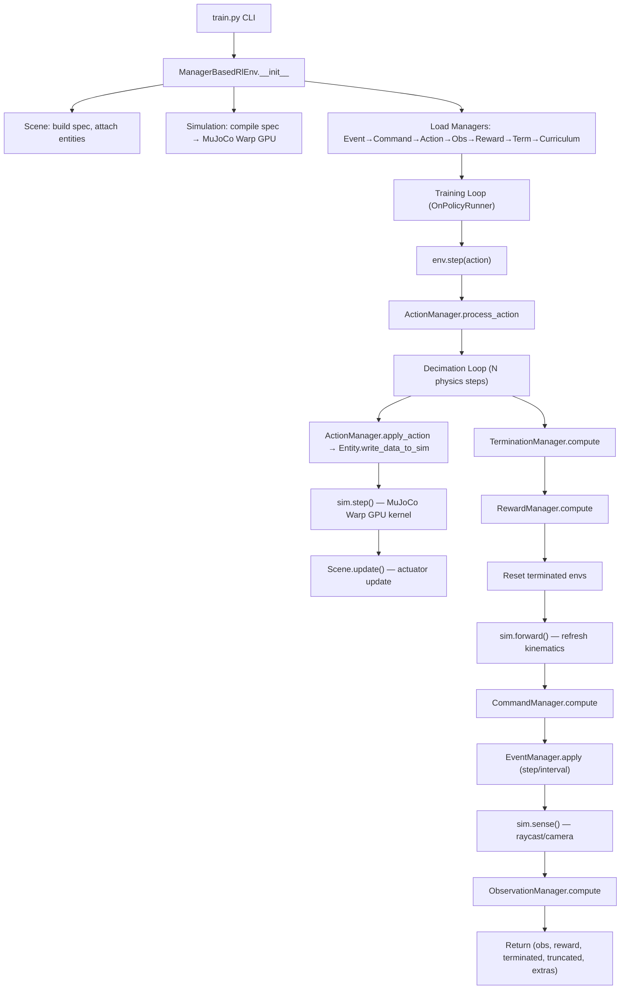

# Phân Tích Kiến Trúc Mjlab — `src/mjlab`

## 1. Tổng Quan

**mjlab** = Isaac Lab's Manager-Based API + MuJoCo Warp (GPU-accelerated MuJoCo).

Mục tiêu: cung cấp framework **composable** cho thiết kế environment RL robotics, chạy **hàng nghìn env song song trên GPU** với physics MuJoCo.

```
src/mjlab/
├── __init__.py          # Khởi tạo Warp, mediapy, auto-discover task packages
├── sim/                 # 🔴 Lõi vật lý — GPU simulation wrapper
├── entity/              # 🟠 Robot/Object abstraction
├── scene/               # 🟡 Tổ hợp scene (entities + sensors + terrain)
├── managers/            # 🟢 MDP pipeline (obs, action, reward, event, ...)
├── envs/                # 🔵 RL Environment chính (step loop)
├── actuator/            # ⚙️  Mô hình actuator (PD, learned, DC motor, ...)
├── sensor/              # 📡 Sensor (raycast, camera, contact, builtin)
├── terrains/            # 🏔️  Procedural terrain generation
├── rl/                  # 🧠 PPO training (rsl-rl wrapper)
├── tasks/               # 📋 Task configs (velocity, tracking, cartpole, ...)
├── scripts/             # 🚀 CLI entry points (train, play, demo)
├── viewer/              # 👁️  Visualization (viser, native, offscreen)
├── asset_zoo/           # 🤖 Robot MJCF assets
└── utils/               # 🔧 Helpers (noise, buffers, xml, spec, ...)
```

---

## 2. Sơ Đồ Luồng Dữ Liệu Tổng Thể



---

## 3. Phân Tích Từng Module

### 3.1 `sim/` — Lõi Vật Lý GPU

| File | Vai trò |
|------|---------|
| [sim.py](file:///home/khanh248/Documents/Vin/mjlab/mjlab-main/src/mjlab/sim/sim.py) | Class `Simulation` — wrapper chính cho MuJoCo Warp |
| [sim_data.py](file:///home/khanh248/Documents/Vin/mjlab/mjlab-main/src/mjlab/sim/sim_data.py) | `WarpBridge`, `TorchArray` — zero-copy bridge giữa Warp arrays ↔ PyTorch tensors |
| [randomization.py](file:///home/khanh248/Documents/Vin/mjlab/mjlab-main/src/mjlab/sim/randomization.py) | `expand_model_fields()` — mở rộng model fields cho per-env Domain Randomization |

**Điểm quan trọng:**

- **CUDA Graph Capture**: `Simulation.create_graph()` capture toàn bộ `step()`, `forward()`, `reset()` thành CUDA graphs → replay bằng **1 kernel launch** thay vì hàng trăm dispatch calls → giảm CPU overhead cực lớn.
- **WarpBridge**: Truy cập `sim.data.qpos`, `sim.model.body_mass` trả về **PyTorch tensor** (zero-copy từ Warp GPU array), cho phép dùng PyTorch ops trực tiếp.
- **Per-env randomization**: `expand_model_fields()` nhân rộng fields như `body_mass`, `geom_friction` thành `(nworld, ...)` → mỗi env có tham số vật lý riêng.

```python
# Luồng khởi tạo:
spec.compile() → MjModel (CPU)
    → mjwarp.put_model() → GPU Model
    → mjwarp.put_data(nworld=4096) → GPU Data (4096 envs song song)
    → create_graph() → CUDA graphs cho step/forward/reset
```

---

### 3.2 `entity/` — Trừu Tượng Hóa Robot/Object

| File | Vai trò |
|------|---------|
| [entity.py](file:///home/khanh248/Documents/Vin/mjlab/mjlab-main/src/mjlab/entity/entity.py) | Class `Entity` — đại diện cho 1 vật thể (robot, object, prop) |
| [data.py](file:///home/khanh248/Documents/Vin/mjlab/mjlab-main/src/mjlab/entity/data.py) | `EntityData` — state tensors (root pose, joint pos/vel, targets, limits) |
| [variants.py](file:///home/khanh248/Documents/Vin/mjlab/mjlab-main/src/mjlab/entity/variants.py) | Per-world mesh variants (mỗi env có thể có mesh robot khác nhau) |

**Entity Type Matrix:**

| Loại | Ví dụ | Fixed Base | Articulated | Actuated |
|------|-------|:----------:|:-----------:|:--------:|
| Fixed Non-articulated | Bàn, tường | ✅ | ❌ | ❌ |
| Fixed Articulated | Robot arm | ✅ | ✅ | ✅ |
| Floating Non-articulated | Hộp, bóng | ❌ | ❌ | ❌ |
| Floating Articulated | Humanoid, quadruped | ❌ | ✅ | ✅ |

**Entity lifecycle:**
1. `__init__`: build MjSpec → identify joints → apply editors (camera, light, collision) → add actuators → add keyframe
2. `initialize()`: compute global indexing (body_ids, joint_ids, ctrl_ids, q_adr, v_adr) → init actuators → allocate EntityData tensors
3. Runtime: `write_data_to_sim()` → `update(dt)` → `reset(env_ids)`

---

### 3.3 `scene/` — Tổ Hợp Scene

[scene.py](file:///home/khanh248/Documents/Vin/mjlab/mjlab-main/src/mjlab/scene/scene.py) quản lý việc **ghép** entities, terrain, sensors thành 1 MjSpec duy nhất.

```python
# Luồng build:
Scene.__init__():
  spec = MjSpec.from_file("scene.xml")  # Base scene (sky, ground, lights)
  _add_terrain()    # Attach terrain spec
  _add_entities()   # Attach each entity spec với prefix (e.g., "robot/")
  _add_sensors()    # Add sensor specs
```

> [!IMPORTANT]
> Mỗi entity được `attach()` với prefix riêng (e.g., `"robot/"`) → tránh xung đột tên. Keyframes từ các entity được **merge** thành 1 keyframe chung `"init_state"`.

---

### 3.4 `managers/` — MDP Pipeline (Trung Tâm Framework)

Đây là **hệ thống quản lý modular** theo pattern Isaac Lab. Mỗi manager xử lý 1 khía cạnh của MDP:

| Manager | File | Chức năng |
|---------|------|-----------|
| **ManagerBase** | `manager_base.py` | Abstract base — `_prepare_terms()`, `_resolve_common_term_cfg()` |
| **ActionManager** | `action_manager.py` | Chia action tensor → route đến ActionTerm → ghi vào actuator targets |
| **ObservationManager** | `observation_manager.py` | Compute obs groups (actor/critic) — pipeline: `func → noise → clip → scale → delay → history` |
| **RewardManager** | `reward_manager.py` | Tính reward = Σ(func × weight × dt) — NaN guard, episode sums |
| **TerminationManager** | `termination_manager.py` | Check điều kiện kết thúc (time_out, fell_over, ...) |
| **EventManager** | `event_manager.py` | Domain Randomization + State Resets — modes: startup, reset, step, interval |
| **CommandManager** | `command_manager.py` | Generate commands (velocity targets, motion references) |
| **CurriculumManager** | `curriculum_manager.py` | Adaptive difficulty (terrain levels, velocity ranges) |
| **MetricsManager** | `metrics_manager.py` | Custom logging metrics (per-substep + per-step) |
| **RecorderManager** | `recorder_manager.py` | Record rollout data cho analysis |

**Term-based architecture:** Mỗi manager chứa nhiều **terms** (functions/classes). Ví dụ RewardManager có terms: `track_linear_velocity`, `action_rate_l2`, `feet_air_time`, ...

```python
# Pattern chung:
@dataclass
class RewardTermCfg(ManagerTermBaseCfg):
    func: Callable  # Hàm tính reward
    weight: float   # Trọng số

# Trong config:
rewards = {
    "track_linear_velocity": RewardTermCfg(func=mdp.track_linear_velocity, weight=2.0),
    "action_rate_l2": RewardTermCfg(func=mdp.action_rate_l2, weight=-0.1),
}
```

---

### 3.5 `envs/` — RL Environment

| File | Vai trò |
|------|---------|
| [manager_based_rl_env.py](file:///home/khanh248/Documents/Vin/mjlab/mjlab-main/src/mjlab/envs/manager_based_rl_env.py) | `ManagerBasedRlEnv` — class chính, orchestrate toàn bộ |
| `mdp/` | Thư viện hàm MDP dùng chung (observations, rewards, events, terminations, actions, DR) |

**`env.step(action)` chi tiết:**

```
1. action_manager.process_action(action)     # Chia + scale action
2. for _ in range(decimation):               # N bước physics
   ├── action_manager.apply_action()          # Ghi target vào entity
   ├── scene.write_data_to_sim()              # Entity → sim (ctrl, qpos, ...)
   ├── sim.step()                             # MuJoCo Warp GPU step
   ├── scene.update(dt)                       # Actuator update
   └── metrics_manager.compute_substep()
3. termination_manager.compute()              # Check done conditions
4. reward_manager.compute(dt)                 # Tính reward
5. Reset terminated envs (if auto_reset)
6. sim.forward()                              # Refresh kinematics (1 lần duy nhất)
7. command_manager.compute(dt)                # Update commands
8. event_manager.apply(step/interval)         # Domain randomization
9. sim.sense()                                # Raycast, camera rendering
10. observation_manager.compute()             # Build obs tensors
11. Return (obs, reward, terminated, truncated, extras)
```

> [!NOTE]
> **Decimation**: `env_dt = physics_dt × decimation`. Với `timestep=0.005, decimation=4` → control tại **50 Hz**, physics tại **200 Hz**. Policy chạy ở tần số thấp hơn physics.

> [!NOTE]
> **Forward call placement**: `sim.forward()` chỉ gọi **1 lần** sau cả decimation loop + reset, không gọi 2 lần. Reward/termination thấy derived quantities (xpos, xquat) bị stale 1 substep — chấp nhận được vì consistent across all envs.

---

### 3.6 `actuator/` — Mô Hình Actuator

| File | Mô tả |
|------|-------|
| `actuator.py` | Base `Actuator` class — `edit_spec()`, `initialize()`, `compute()` |
| `pd_actuator.py` | PD controller (joint position/velocity tracking) |
| `dc_actuator.py` | DC motor model (torque limits, velocity-dependent) |
| `learned_actuator.py` | Neural network actuator (sim-to-real gap mitigation) |
| `builtin_actuator.py` | MuJoCo native actuators (position, velocity, motor) |
| `builtin_group.py` | Vectorized processing cho builtin actuators |
| `xml_actuator.py` | Wrap actuators đã có sẵn trong MJCF XML |

**Luồng**: Policy output → `ActionTerm.process_actions()` (scale + offset) → ghi vào `entity.data.joint_pos_target` → `entity.write_data_to_sim()` → actuator compute ctrl → `sim.step()`.

---

### 3.7 `sensor/` — Cảm Biến

| File | Mô tả |
|------|-------|
| `sensor.py` | Base `Sensor` class |
| `builtin_sensor.py` | Wrap MuJoCo builtin sensors (IMU, gyro, accelerometer, ...) |
| `contact_sensor.py` | Contact force sensing (feet ground contact) |
| `raycast_sensor.py` | GPU raycast cho terrain scanning |
| `camera_sensor.py` | Camera rendering trên GPU |
| `terrain_height_sensor.py` | Đo chiều cao terrain tại feet |
| `sensor_context.py` | Shared GPU resources cho raycast + camera (BVH, render context) |

**SensorContext**: Quản lý pipeline `refit_bvh → render → raycast` trong 1 CUDA graph capture → tối ưu.

---

### 3.8 `terrains/` — Địa Hình

| File | Mô tả |
|------|-------|
| `terrain_entity.py` | `TerrainEntity` — entity đặc biệt cho terrain |
| `terrain_generator.py` | Procedural terrain generation |
| `primitive_terrains.py` | Flat, slope, stairs, pyramid, stepping stones, ... |
| `heightfield_terrains.py` | Heightfield-based terrains (random, fractal) |
| `config.py` | Preset configs (ROUGH_TERRAINS_CFG, ...) |
| `utils.py` | Terrain utilities |

Terrain được chia thành **grid**: rows = difficulty levels, cols = terrain types. Curriculum manager di chuyển robot qua các level khó hơn dần.

---

### 3.9 `rl/` — Reinforcement Learning

| File | Vai trò |
|------|---------|
| [config.py](file:///home/khanh248/Documents/Vin/mjlab/mjlab-main/src/mjlab/rl/config.py) | `RslRlOnPolicyRunnerCfg` — PPO hyperparams (lr, gamma, λ, clip, ...) |
| [runner.py](file:///home/khanh248/Documents/Vin/mjlab/mjlab-main/src/mjlab/rl/runner.py) | `MjlabOnPolicyRunner` — extends rsl-rl OnPolicyRunner |
| [vecenv_wrapper.py](file:///home/khanh248/Documents/Vin/mjlab/mjlab-main/src/mjlab/rl/vecenv_wrapper.py) | `RslRlVecEnvWrapper` — adapter giữa mjlab env ↔ rsl-rl VecEnv |
| `spatial_softmax.py` | Spatial softmax layer cho CNN policies |

**PPO Config mặc định:**
- Actor/Critic: MLP `[128, 128, 128]`, ELU activation
- PPO: `γ=0.99, λ=0.95, clip=0.2, lr=1e-3 (adaptive), 5 epochs, 4 mini-batches`
- Actor: Gaussian distribution, `init_std=1.0`
- Critic: Deterministic output (no distribution)
- `num_steps_per_env=24` (rollout horizon)

**Privileged Critic**: Actor nhận obs có noise (sensor noise, delay) → **actor group**. Critic nhận obs sạch + extra info (foot contact forces, air time) → **critic group**. Giúp critic có value estimate chính xác hơn.

---

### 3.10 `tasks/` — Task Definitions

```
tasks/
├── registry.py          # Task registry (load_env_cfg, load_rl_cfg)
├── velocity/            # Velocity tracking task
│   ├── velocity_env_cfg.py  # Factory function make_velocity_env_cfg()
│   ├── config/              # Per-robot configs (G1, H1, Go2, ...)
│   ├── mdp/                 # Task-specific MDP functions
│   └── rl/                  # Per-robot RL configs
├── tracking/            # Motion imitation task
├── cartpole/            # Simple test task
└── manipulation/        # Manipulation tasks
```

Mỗi task = 1 `ManagerBasedRlEnvCfg` hoàn chỉnh, định nghĩa toàn bộ MDP: scene, observations, actions, rewards, terminations, events, curriculum.

---

### 3.11 `scripts/` — CLI Entry Points

| Script | Command | Mô tả |
|--------|---------|-------|
| `train.py` | `uv run train` | Train PPO agent — multi-GPU support via torchrunx |
| `play.py` | `uv run play` | Evaluate policy (load checkpoint từ local/W&B) |
| `demo.py` | `uv run demo` | Quick demo không cần install |
| `list_envs.py` | `uv run list-envs` | Liệt kê tất cả registered tasks |
| `nan_viz.py` | `uv run viz-nan` | Visualize NaN guard captures |
| `export_scene.py` | `uv run export-scene` | Export scene XML + meshes |

---

### 3.12 `viewer/` — Visualization

| File | Mô tả |
|------|-------|
| `base.py` | Base viewer class |
| `viser/` | Web-based viewer (viser library) |
| `native/` | Native MuJoCo viewer |
| `offscreen_renderer.py` | Headless rendering cho video recording |
| `debug_visualizer.py` | Debug overlays (arrows, spheres cho rewards, commands) |
| `model_sync.py` | Sync GPU model → CPU model cho rendering |

---

### 3.13 `asset_zoo/` — Robot Assets

Chứa MJCF XML definitions cho các robot: Unitree G1, H1, Go2, ANYmal, ...

---

### 3.14 `utils/` — Utilities

| File/Dir | Mô tả |
|----------|-------|
| `spec.py`, `spec_config.py` | MjSpec manipulation (cameras, lights, collisions) |
| `noise/` | Noise models (Uniform, Gaussian) cho observation corruption |
| `buffers/` | CircularBuffer (history), DelayBuffer (sensor latency) |
| `nan_guard.py` | Detect NaN in simulation, dump debug info |
| `xml.py` | XML fixing utilities |
| `lab_api/` | Forked utilities từ Isaac Lab (BSD-3-Clause) |
| `gpu.py`, `torch.py` | GPU selection, torch backend config |
| `wandb.py` | Weights & Biases integration |

---

## 4. Tóm Tắt Luồng Training End-to-End

```
1. CLI: uv run train Mjlab-Velocity-Flat-Unitree-G1 --env.scene.num-envs 4096

2. train.py:
   ├── Parse task ID → load env_cfg + rl_cfg từ registry
   ├── Select GPU(s), configure torch backends
   ├── Create ManagerBasedRlEnv(cfg, device="cuda:0")
   │   ├── Scene: build robot entity + terrain + sensors → compile MjSpec
   │   ├── Simulation: MjSpec → MuJoCo Warp GPU (4096 worlds)
   │   │   └── CUDA Graph capture cho step/forward/reset
   │   └── Load Managers: Event → expand DR fields → Command → Action → Obs → Reward → Term → Curriculum
   ├── Wrap env → RslRlVecEnvWrapper
   └── MjlabOnPolicyRunner.learn(max_iterations)

3. Training Loop (mỗi iteration):
   ├── Rollout: collect 24 steps × 4096 envs
   │   └── Mỗi step: env.step(action) → (obs, reward, done, info)
   ├── Compute GAE advantages
   ├── PPO update: 5 epochs × 4 mini-batches
   │   ├── Actor loss: clipped surrogate + entropy bonus
   │   └── Critic loss: clipped value loss
   ├── Log to W&B / TensorBoard
   └── Save checkpoint mỗi 50 iterations
```

> [!TIP]
> **Tốc độ**: Với CUDA graphs + MuJoCo Warp, mjlab có thể chạy **hàng triệu physics steps/giây** trên 1 GPU. Bottleneck chủ yếu là Python overhead giữa các calls, được giảm thiểu bởi CUDA graph replay.
